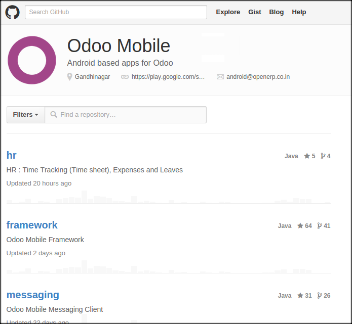
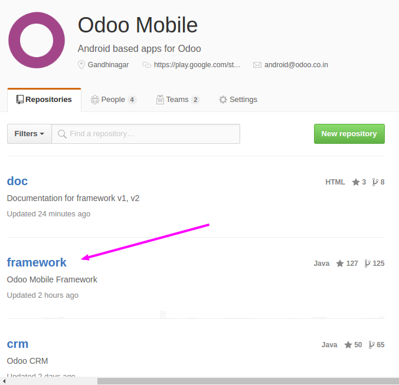
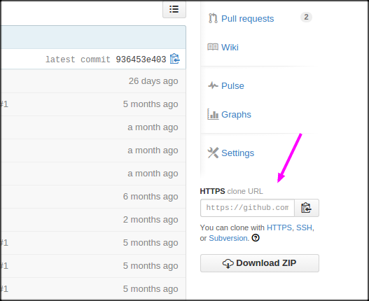
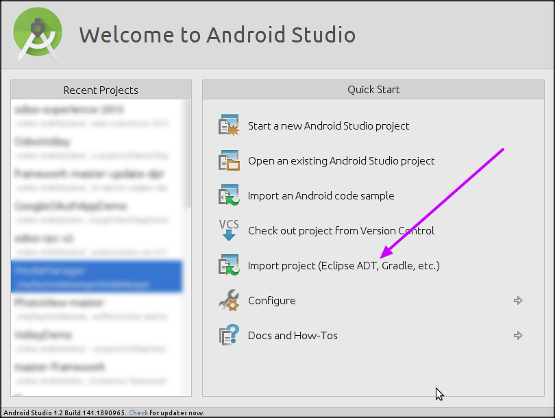
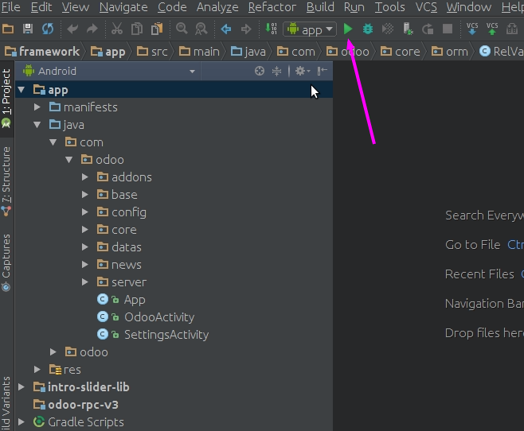

Download framework from GitHub for Android
==========================================

.. index:: Git Repositories

Visit Odoo Mobile Repositories
~~~~~~~~~~~~~~~~~~~~~~~~~~~~~~

https://github.com/Odoo-mobile

Here you can find all the repositories developed by Odoo S.A. 

Click on Framework
~~~~~~~~~~~~~~~~~~

.. index:: Odoo Mobile Framework

https://github.com/Odoo-mobile/framework

You can also choose another repository source code such as **crm**, **notes**

Clone or download source code for Odoo Mobile Framework
~~~~~~~~~~~~~~~~~~~~~~~~~~~~~~~~~~~~~~~~~~~~~~~~~~~~~~~~

.. index:: Clone Framework

Import framework code to your Android Studio
~~~~~~~~~~~~~~~~~~~~~~~~~~~~~~~~~~~~~~~~~~~~

.. index:: Import to Android Studio

Import your project source by selecting **Import Project**

Test Framework application build for loading customers, suppliers and companies
~~~~~~~~~~~~~~~~~~~~~~~~~~~~~~~~~~~~~~~~~~~~~~~~~~~~~~~~~~~~~~~~~~~~~~~~~~~~~~~

After successfully load your project to Android Studio you can run it by pressing **Run App** button from toolbar.

Usefull links and emails
~~~~~~~~~~~~~~~~~~~~~~~~~

.. index:: Submit Issue

Odoo Mobile Repositories : https://github.com/odoo-mobile

Odoo Mobile Framework Issues : https://github.com/Odoo-mobile/framework/issues

Contact us: android@openerp.co.in