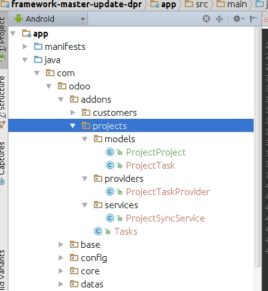
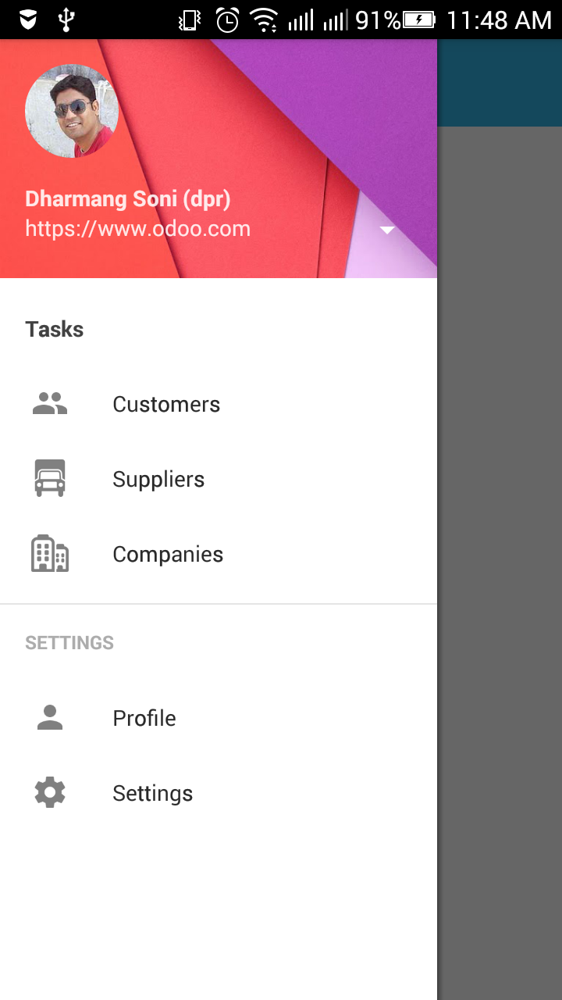
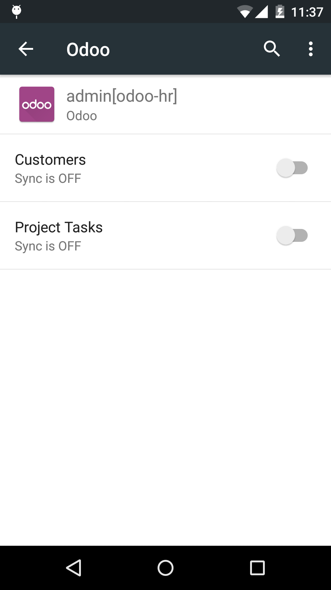
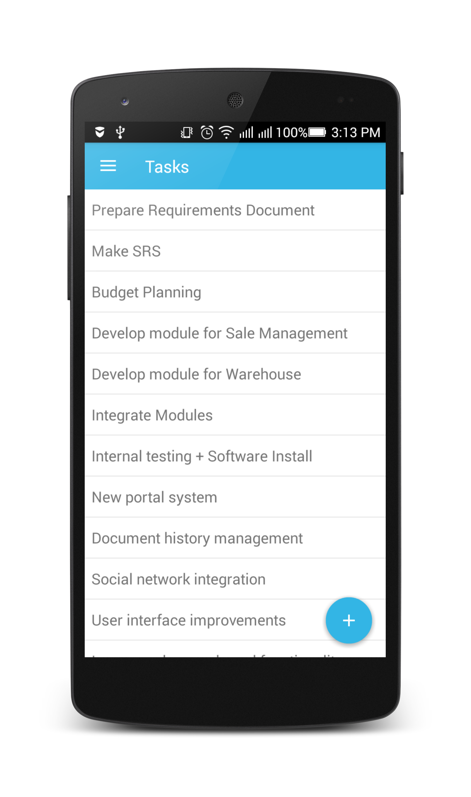

Addons
======

.. index:: Addons

Here, We take example for Project tasks.

Creating addon with odoo mobile
-------------------------------

Each of the addon in the odoo mobile app is the feature for your application. It contains, models, providers (for synchronization service and database operation), background services, **BaseFragment** (your addon startup class fragment), another **Activities** or **Fragments** as you required and other utilities used by your addon. 

Here you can see one example with some of models, services, providers and other classes.

Your addon main class extends ``BaseFragment`` and implement two methods:

1. drawerMenus()
2. database()

``drawerMenus()``
*****************

For your addons navigation menus, BaseFragment provide method to be implement for generating menu under application drawer. Returns list of ``DrawerItem``

.. code-block:: java

	class Tasks extends BaseFragments {

		...
		...
		...

		@Override
	    public List<ODrawerItem> drawerMenus(Context context) {
	        List<ODrawerItem> menu = new ArrayList<>();
	        menu.add(new ODrawerItem(TAG).setTitle("Tasks").setInstance(new Tasks()));
	        return menu;
	    }
	}

@See more :doc:`drawer-menu`

``database()``
**************

Database method return class type of base database model. It used for creating database tables when appliction start first time.

return type class for model.

.. code-block:: java

	public class Tasks extends BaseFragment {
	    public static final String TAG = Tasks.class.getSimpleName();

	    @Override
	    public List<ODrawerItem> drawerMenus(Context context) {
	        List<ODrawerItem> menu = new ArrayList<>();
	        menu.add(new ODrawerItem(TAG).setTitle("Tasks").setInstance(new Tasks()));
	        return menu;
	    }

	    @Override
	    public Class<ProjectTask> database() {
	        return ProjectTask.class;
	    }
	}

Creating Models for addon
--------------------------

.. index:: Create Model

Here, we are going to create ``ProjectProject`` model class for ``project.project``  and ``ProjectTask`` model class for ``project.task`` under ``com.odoo.addons.projects.models`` package

.. code-block:: java

	public class ProjectProject extends OModel {
	    public static final String TAG = ProjectProject.class.getSimpleName();

	    OColumn name = new OColumn("Name", OVarchar.class).setSize(100);

	    public ProjectProject(Context context, OUser user) {
	        super(context, "project.project", user);
	    }
	}

	public class ProjectTask extends OModel {
	    public static final String TAG = ProjectTask.class.getSimpleName();

	    OColumn name = new OColumn("Name", OVarchar.class).setSize(100);
	    OColumn project_id = new OColumn("Project", ProjectProject.class, OColumn.RelationType.ManyToOne);
	    OColumn description = new OColumn("Description", OText.class);

	    public ProjectTask(Context context, OUser user) {
	        super(context, "project.task", user);
	    }
	}

``ProjectTask`` contains ``project_id`` column related to ``ProjectProject`` class type with ``ManyToOne`` relation.

We have passed ``ProjectTask.class`` to ``database()`` method. So, when framework creating database, it will take all the relation models in columns and create its master table.

Now, for running app. You need to register your main class to addons registery as below.

Registering addon to Addons registry
------------------------------------

.. index:: Register Addon

Each of the modules (addons) are registered under ``Addons.java`` class of ``com.odoo.config`` package.

.. code-block:: java

	public class Addons extends AddonsHelper {

	    OAddon customers = new OAddon(Customers.class).setDefault();
	    OAddon tasks = new OAddon(Tasks.class);
	}

To make tasks default just add chaining method, ``setDefault()``

To short menu, by addons just rename your addons variable in alphabatical order.

.. code-block:: java

	public class Addons extends AddonsHelper {

	    OAddon a_tasks = new OAddon(Tasks.class).setDefault();
	    OAddon b_customers = new OAddon(Customers.class);
	}

Creating Sync service 
----------------------

The sync service component in app encapsulates the code for the tasks that transfer data between the device and a server. Based on the scheduling and triggers provided by application, the sync service framework runs the code in the sync adapter component and perform database operation with received data from server. To create sync service for your addon, you need to add the following pieces:

- Sync Service class (extends ``OSyncService`` class)
- Custom database provider class with your ``AUTHORITY`` (extends ``BaseModelProvider`` class) 
- Sync adapter XML metadata file.
- Declarations in the app manifest.

Sync Service class 
*******************

A component that allows the sync framework to run the code in your sync adapter class for given model.

@See more :ref:`sync-service-class`

.. code-block:: java
	
	package com.odoo.addons.projects.services;

	import android.content.Context;
	import android.os.Bundle;

	import com.odoo.addons.projects.models.ProjectTask;
	import com.odoo.core.service.OSyncAdapter;
	import com.odoo.core.service.OSyncService;
	import com.odoo.core.support.OUser;

	public class ProjectSyncService extends OSyncService {
	    public static final String TAG = ProjectSyncService.class.getSimpleName();

	    @Override
	    public OSyncAdapter getSyncAdapter(OSyncService service, Context context) {
	        return new OSyncAdapter(getApplicationContext(), ProjectTask.class, this, true);
	    }

	    @Override
	    public void performDataSync(OSyncAdapter adapter, Bundle extras, OUser user) {
			adapter.syncDataLimit(80);
	    }
	}

Custom database provider class with your AUTHORITY (extends BaseModelProvider class)
************************************************************************************

The sync adapter framework is designed to work with device data managed by the flexible and highly secure content provider framework. For this reason, the sync adapter framework expects that an app that uses the framework has already defined a content provider for its local data. If the sync adapter framework tries to run your sync adapter, and your app doesn't have a content provider, your sync adapter crashes.

Here, odoo mobile framework have pre defined methods and mechanism to handle your data with content provider. The one ``BaseModelProvider`` is central ``ContentProvider`` for all models with base ``AUTHORITY`` shared with each of the model. 

But, in case of creating custom sync service we required different content provider to be registerd in Android Manifest file. To do so, we just need to extend ``BaseModelProvider`` and provide our custom AUTHORITY by overriding ``authority()`` method.

Here is snippet:

Adding custom AUTHORITY to Model

.. code-block:: java

	public class ProjectTask extends OModel {
		public static final String TAG = ProjectTask.class.getSimpleName();
		public static final String AUTHORITY = "com.odoo.addons.projects.project_tasks";

		OColumn name = new OColumn("Name", OVarchar.class).setSize(100);
		OColumn project_id = new OColumn("Project", ProjectProject.class, OColumn.RelationType.ManyToOne);
		OColumn description = new OColumn("Description", OText.class);

		public ProjectTask(Context context, OUser user) {
		    super(context, "project.task", user);
		}

		@Override
		public Uri uri() {
		    return buildURI(AUTHORITY);
		}
	}

Creating provider class:

.. code-block:: java

	package com.odoo.addons.projects.providers;

	import com.odoo.addons.projects.models.ProjectTask;
	import com.odoo.core.orm.provider.BaseModelProvider;

	public class ProjectTaskProvider extends BaseModelProvider {
	    public static final String TAG = ProjectTaskProvider.class.getSimpleName();

	    @Override
	    public String authority() {
	        return ProjectTask.AUTHORITY;
	    }
	}

Sync adapter XML metadata file
******************************

A file containing information about your sync adapter. The framework reads this file to find out how to load and schedule your data transfer.

To plug your sync adapter component into the framework, you need to provide the framework with metadata that describes the component and provides additional flags. The metadata specifies the account type you've created for your sync adapter, declares a content provider authority associated with your app, controls a part of the system user interface related to sync adapters, and declares other sync-related flags. Declare this metadata in a special XML file stored in the ``/res/xml/`` directory in your app project. You can give any name to the file, although it's usually called ``syncadapter.xml``.

See more at : https://developer.android.com/training/sync-adapters/creating-sync-adapter.html#CreateSyncAdapterMetadata

.. code-block:: xml

	<sync-adapter xmlns:android="http://schemas.android.com/apk/res/android"
	    android:accountType="com.odoo.auth"
	    android:contentAuthority="com.odoo.addons.projects.project_tasks"
	    android:supportsUploading="true"
	    android:userVisible="true" />

Declarations in the app manifest
********************************

Registering Service in Manifest file

.. code-block:: xml

	<service android:name=".addons.projects.services.ProjectSyncService"
	        android:exported="true"
	        android:process=":sync_tasks">
	    <intent-filter>
	        <action android:name="android.content.SyncAdapter" />
	    </intent-filter>

	    <meta-data
	        android:name="android.content.SyncAdapter"
	        android:resource="@xml/task_sync_adapter" />
	</service>

Registering Provider for sync service :

.. code-block:: xml

    <provider
        android:name="com.odoo.addons.projects.providers.ProjectTaskProvider"
        android:authorities="com.odoo.addons.projects.project_tasks"
        android:label="Project Tasks"
        android:multiprocess="true" />

All Done !

Launch your application by cleaning app data. (need to clean because we have updated database.)

You can see sync option for project tasks under your account:

Working with ``R.layout.common_listview`` layout
-------------------------------------------------

``common_listview`` layout contains ``ListView`` with ``SwipeRefreshLayout`` and empty view layout. If you need to load list of rows on your fragment load you can use this common list view which can be easy to integrate with ``BaseFragment`` as shown below:

Inflating view
**************

.. code-block:: java

	public class Tasks extends BaseFragment {
	    public static final String TAG = Tasks.class.getSimpleName();

	    private View mView;
	    
	    @Override
	    public View onCreateView(LayoutInflater inflater,
	                             ViewGroup container, Bundle savedInstanceState) {
	        return inflater.inflate(R.layout.common_listview, container, false);
	    }

	    @Override
	    public void onViewCreated(View view, Bundle savedInstanceState) {
	        super.onViewCreated(view, savedInstanceState);
	        mView = view;
	    }

		...
		...
	}

Declare and initialize controls
*******************************

.. code-block:: java

	public class Tasks extends BaseFragment {
		public static final String TAG = Tasks.class.getSimpleName();

		private View mView;
		private ListView listView;
		private OCursorListAdapter listAdapter;

		...
		...

		@Override
		public void onViewCreated(View view, Bundle savedInstanceState) {
		    super.onViewCreated(view, savedInstanceState);
		    mView = view;
		    listView = (ListView) mView.findViewById(R.id.listview);
		    listAdapter = new OCursorListAdapter(getActivity(), null, android.R.layout.simple_list_item_1);
		    listView.setAdapter(listAdapter);
		}

		...
		...

Registering loader manager
**************************

.. code-block:: java

	public class Tasks extends BaseFragment implements LoaderManager.LoaderCallbacks<Cursor> {
	    public static final String TAG = Tasks.class.getSimpleName();

	    ...
	    ...

		@Override
		public void onViewCreated(View view, Bundle savedInstanceState) {
			super.onViewCreated(view, savedInstanceState);
			mView = view;
			listView = (ListView) mView.findViewById(R.id.listview);
			listAdapter = new OCursorListAdapter(getActivity(), null, android.R.layout.simple_list_item_1);
			listView.setAdapter(listAdapter);
			getLoaderManager().initLoader(0, null, this);
		}

		@Override
		public Loader<Cursor> onCreateLoader(int id, Bundle args) {
			return new CursorLoader(getActivity(), db().uri(), null, null, null, null);
		}

		@Override
		public void onLoadFinished(Loader<Cursor> loader, Cursor data) {
			listAdapter.changeCursor(data);
			if (data.getCount() > 0) {
				OControls.setGone(mView, R.id.loadingProgress);
				OControls.setVisible(mView, R.id.swipe_container);
				OControls.setGone(mView, R.id.no_items);
			} else {
				OControls.setGone(mView, R.id.loadingProgress);
				OControls.setGone(mView, R.id.swipe_container);
				OControls.setVisible(mView, R.id.no_items);
				OControls.setText(mView, R.id.title, "No Tasks found");
				OControls.setText(mView, R.id.subTitle, "Swipe to check new tasks");
			}
			if (db().isEmptyTable()) {
				// Request for sync
			}
		}

		@Override
		public void onLoaderReset(Loader<Cursor> loader) {
			listAdapter.changeCursor(null);
		}

		...
		...
	}

Registering sync (SwipeRefresh) control and sync observer
**********************************************************

@See more :ref:`swipe-refresh-view`

@See more :ref:`sync-status-observer`

Swipe refresh view listener:

.. code-block:: java

	public class Tasks extends BaseFragment implements LoaderManager.LoaderCallbacks<Cursor>,
	        ISyncStatusObserverListener, SwipeRefreshLayout.OnRefreshListener {
	        ...
	        ...

		@Override
		public void onLoadFinished(Loader<Cursor> loader, Cursor data) {
			listAdapter.changeCursor(data);
			if (data.getCount() > 0) {
				OControls.setGone(mView, R.id.loadingProgress);
				OControls.setVisible(mView, R.id.swipe_container);
				OControls.setGone(mView, R.id.no_items);
				setHasSwipeRefreshView(mView, R.id.swipe_container, this);
			} else {
				OControls.setGone(mView, R.id.loadingProgress);
				OControls.setGone(mView, R.id.swipe_container);
				OControls.setVisible(mView, R.id.no_items);
				setHasSwipeRefreshView(mView, R.id.no_items, this);
				OControls.setText(mView, R.id.title, "No Tasks found");
				OControls.setText(mView, R.id.subTitle, "Swipe to check new tasks");
			}
			if (db().isEmptyTable()) {
				// Request for sync
				onRefresh();
			}
		}

		@Override
		public void onRefresh() {
			if (inNetwork()) {
				parent().sync().requestSync(ProjectTask.AUTHORITY);
			}
		}

		...
		...
	}

Sync status observer:

.. code-block:: java

	public class Tasks extends BaseFragment implements LoaderManager.LoaderCallbacks<Cursor>,
	    ISyncStatusObserverListener {

		...
		...

		@Override
		public void onViewCreated(View view, Bundle savedInstanceState) {
			super.onViewCreated(view, savedInstanceState);
			mView = view;
			listView = (ListView) mView.findViewById(R.id.listview);
			listAdapter = new OCursorListAdapter(getActivity(), null, android.R.layout.simple_list_item_1);
			listView.setAdapter(listAdapter);

			setHasSyncStatusObserver(TAG, this, db());
			getLoaderManager().initLoader(0, null, this);
		}

		@Override
		public void onStatusChange(Boolean changed) {
			if(changed){
				getLoaderManager().restartLoader(0, null, this);
			}
		}

		...
		...

	}

Binding View
************

.. code-block:: java

	public class Tasks extends BaseFragment implements LoaderManager.LoaderCallbacks<Cursor>,
	        ISyncStatusObserverListener, SwipeRefreshLayout.OnRefreshListener, OCursorListAdapter.OnViewBindListener {
	    ...
	    ...

	    @Override
	    public void onViewCreated(View view, Bundle savedInstanceState) {
	        super.onViewCreated(view, savedInstanceState);
	        mView = view;
	        listView = (ListView) mView.findViewById(R.id.listview);
	        listAdapter = new OCursorListAdapter(getActivity(), null, android.R.layout.simple_list_item_1);
	        listView.setAdapter(listAdapter);

	        listAdapter.setOnViewBindListener(this);

	        setHasSyncStatusObserver(TAG, this, db());
	        getLoaderManager().initLoader(0, null, this);
	    }

	    @Override
	    public void onViewBind(View view, Cursor cursor, ODataRow row) {
	        OControls.setText(view, android.R.id.text1, row.getString("name"));
	    }

	    ...
	    ...

	}

