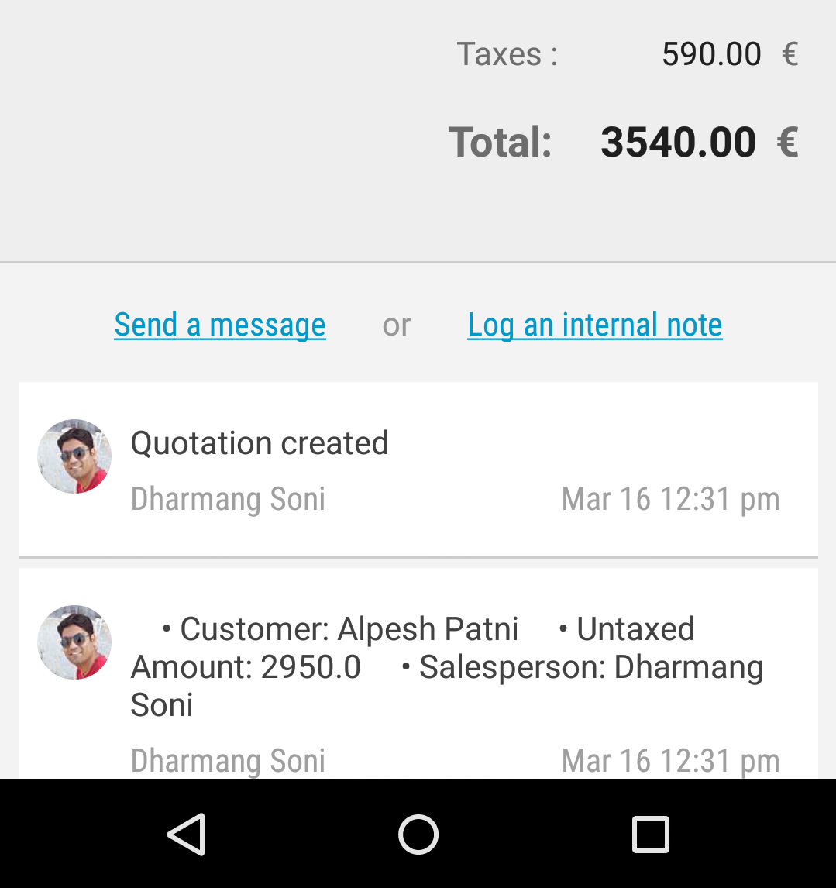

Chatter view
============

.. index:: Chatter View

Full history on your record. OForm control integrated with Mail chatter for your record. You just need to activate chatter for your model and OForm will take care for loading chatter view for your record. 

Supported features:

- Log internal note with attachments
- Send message to followers with attachments

Two way to enable chatter for your model:

Enable from model
-----------------

Call method ``setHasMailChatter()`` in model's constructor.

.. code-block:: java

	public class ResPartner extends OModel {
	    ...
	    ...

	    public ResPartner(Context context, OUser user){
	            super(context, "res.partner", user);

	            setHasMailChatter(true);
	    }
	}

It will add chatter view for synced record in ``OForm`` automatically.

Enable at runtime
-----------------

OForm widget contains method to handle chatter view at runtime even if you have specified it in model. By calling ``loadChatter()`` before ``initForm()``

.. code-block:: java

	OForm form = (OForm) view.findViewById(R.id.myForm);
	form.loadChatter(false);
	form.initForm(record);