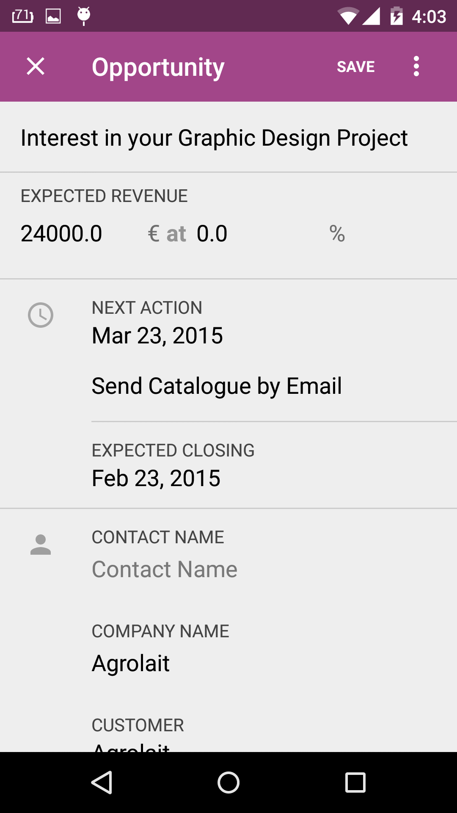
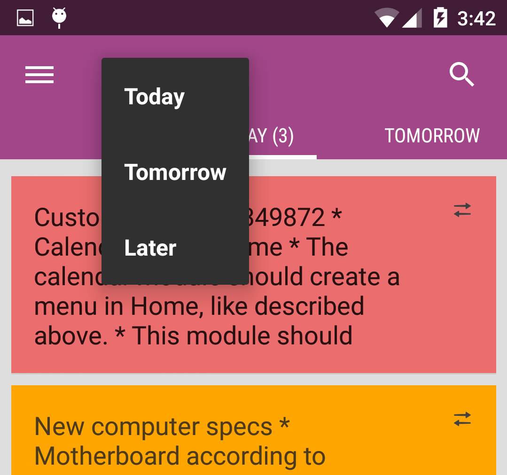

Controls (Form, Fields, actionbar spinner) 
==========================================

.. index:: Controls

To provide faster application development, odoo mobile framework come with some of usefull controls which work with your model record, integrated with chatter view, different data types, on change methods, validations, live search and more.

``OForm`` widget
-----------------

.. index:: OForm

``OForm`` widget used when you need to show model record. It helps record to bind view as per its type. Uses ``OField`` as its inner widgets. You need to just add your fields under ``OForm`` controls. 

It extends ``LinearLayout`` so you can easily change its layout property as per ``LinearLayout`` does. 

Some of other property works with ``OForm``:

- ``prefix:editableMode`` 	: boolean
- ``prefix:modelName``		: string
- ``prefix:autoUIGenerate``	: boolean
- ``prefix:controlIconTint``: color

Here, ``prefix`` is your resource attribute reference. 

.. code-block:: xml

	<RelativeLayout xmlns:android=-http://schemas.android.com/apk/res/android-
	    xmlns:prefix=-http://schemas.android.com/apk/res-auto-
	    android:layout_width=-match_parent-
	    android:layout_height=-match_parent->
		
		<odoo.controls.OForm
			android:id=-@+id/customerFormEdit-
			prefix:modelName=-res.partner-
			android:layout_width=-match_parent-
			android:orientation=-vertical-
			android:layout_height=-wrap_content->
			
			<!-- OFields controls here //-->

		</odoo.controls.OForm>

	</RelativeLayout>

You can take any of valid name for prefix, ADT default take ``app`` as prefix.

**What if you want to add other controls in OForm widget ?**

Yes, you can also add other controls such as ``ImageView``, ``TextView`` or any other controls under ``OForm``. 

editableModel
^^^^^^^^^^^^^

.. index:: editableMode

Takes boolean value (``true|false``). default ``false``. Not required property

Make your form work in editable mode or read only mode.

modelName
^^^^^^^^^

.. index:: modelName

Takes string value (model name). Required property

OForm uses model name to bind your field property. Such as field label, its type and other properties. 

autoUIGenerate
^^^^^^^^^^^^^^

.. index:: autoUIGenerate

Takes boolean value (``true|false``). Default ``true`` Not required property

Responsible to generate responsive layout for your form fields. (works with OFields only, non of your other controls are affected by autoUIGenerate property)

Adds icon (if you have provided to OField), label for field, proper spacing and marging and some other UI changes.

controlIconTint
^^^^^^^^^^^^^^^

.. index:: controlIconTint

Takes color reference value or color code. Not required property

Changes all your OField widget icon tint color.

Initialize form widget
----------------------

``OForm form = (OForm) view.findViewById(R.id.myForm);``

Methods:

initForm()
^^^^^^^^^^^

.. index:: initForm()

**Syntax:**

``void initForm(ODataRow record);``

Initiate form with given record. If record == null, it will load default values if given and create form for new record.

.. code-block:: java

	OForm form = (OFrom) view.findViewById(R.id.myForm);
	form.initForm(null);

setEditable()
^^^^^^^^^^^^^

.. index:: setEditable()

**Syntax:**

``void setEditable(Boolean editable)``

Changes form behaviour to editable/readonly at runtime.

.. code-block:: java

	OForm form  = (OForm) view.findViewById(R.id.myForm);
	form.initForm(null);
	form.setEditable(true);

loadChatter()
^^^^^^^^^^^^^

.. index:: loadChatter()

**Syntax:**

``void loadChatter(boolean loadChatter)``

Loads chatter view at bottom of form. (If record is not synced on server chatter view is not loaded.).

This method must be called before ``initForm()``

.. code-block:: java

	OForm form  = (OForm) view.findViewById(R.id.myForm);
	form.loadChatter(true);
	form.initForm(record);

setIconTintColor()
^^^^^^^^^^^^^^^^^^^

.. index:: setIconTintColor()

**Syntax:**

``void setIconTintColor(int color)``

Changes fields icon tint color at runtime. This method must be called before ``initForm()``

.. code-block:: java

	OForm form  = (OForm) view.findViewById(R.id.myForm);
	form.setIconTintColor(Color.MAGENTA);
	form.initForm(record);

getValues()
^^^^^^^^^^^

.. index:: getValues()

**Syntax:**

``OValues getValues()``

Returns form values, used when you need to create or udpate record. If returns null, may be validation failed.

.. code-block:: java

	OForm form  = (OForm) view.findViewById(R.id.myForm);
	form.initForm(record);

	...
	...

	OValues updatedValues = form.getValues();
	if(updatedValues != null){
		// Store updated values.
	}

``OField`` widget
-----------------

.. index:: OField

OField widget works with ``OForm`` widget. Each of OField is your model's column or just dummy column.

If OForm ``autoUIGenerate`` flag is on, it will create UI with icon (if any), label and column input part. (input box, checkbox, radio button, datetime picker, many to one widget - spinner, and more^^^)

Some of properties you need to know before using ``OField`` control.

``fieldName`` : string
^^^^^^^^^^^^^^^^^^^^^^

.. index:: fieldName

Model's column name or your dummy column name.

.. code-block:: xml

	<odoo.controls.OField
		app:fieldName=-name-
		android:layout_height=-wrap_content-
		android:layout_width=-match_parent->
	</odoo.controls.OField>

``iconResource`` : reference
^^^^^^^^^^^^^^^^^^^^^^^^^^^^

.. index:: iconResource

Field's icon resource. Shows left of control. 

.. code-block:: xml

	<odoo.controls.OField
		android:layout_width=-match_parent-
		app:iconResource=-@drawable/ic_action_message-
		app:fieldName=-email-
		android:layout_height=-wrap_content->
	</odoo.controls.OField>

``iconTint`` : reference|color
^^^^^^^^^^^^^^^^^^^^^^^^^^^^^^

.. index:: iconTint

Changes icon color. takes color refernece or color code.

.. code-block:: xml

	<odoo.controls.OField
		android:layout_width=-match_parent-
		app:iconResource=-@drawable/ic_action_message-
		app:fieldName=-email-
		app:iconTint=-@color/android_green-
		android:layout_height=-wrap_content->
	</odoo.controls.OField>

``showIcon`` : boolean, ``showLabel`` : boolean
^^^^^^^^^^^^^^^^^^^^^^^^^^^^^^^^^^^^^^^^^^^^^^^

.. index:: showIcon

.. index:: showLabel

Show/Hide icon and label. Takes true or false. Default is true

.. code-block:: xml

	<odoo.controls.OField
		android:layout_width=-match_parent-
		app:iconResource=-@drawable/ic_action_message-
		app:fieldName=-email-
		app:showLabel=-false-
		android:layout_height=-wrap_content->
	</odoo.controls.OField>

``parsePattern`` : string
^^^^^^^^^^^^^^^^^^^^^^^^^

.. index:: parsePattern

Used with type, Date, DateTime

.. code-block:: xml

	<odoo.controls.OField
		android:layout_width=-match_parent-
		app:fieldName=-create_date-
		app:parsePattern=-MMM dd, yyyy hh:mm a-
		android:layout_height=-wrap_content->
	</odoo.controls.OField>

``withOutSidePadding`` : boolean
^^^^^^^^^^^^^^^^^^^^^^^^^^^^^^^^^

.. index:: withOutSidePadding

Ignore auto UI generate side padding.

``fieldType`` : enum
^^^^^^^^^^^^^^^^^^^^^

.. index:: fieldType

Generally it automatically taken from Column type. But you can use when you are creating dummy field for OForm

Possible types:

- ``Text``
- ``Text``
- ``ManyToOne``
- ``Selection``
- ``Date``
- ``DateTime``
- ``Blob``
- ``Time``

``widgetType`` : enum
^^^^^^^^^^^^^^^^^^^^^

.. index:: widgetType

In some cases you need to change the control behaviour for your column. such as boolean; it can be shown as checkbox or radio or switch. You can specify your control behaviour by using widget type.

``Switch``
...........

Supported types : boolean

Makes your boolean field behave like switch

``RadioGroup``
..............

Supported types : boolean

Make your boolean field behave like radio button

``SelectionDialog``
...................

Supported types: ManyToOne, Selection

Makes dialog to select from available values refer to manytoone model or given selection.

``Searchable``
..............

Supported types: ManyToOne, Selection

Makes reference values searchable. Open other activity for provide search with available records 

``SearchableLive``
..................

Supported types: ManyToOne

Makes reference value searchable even if there are no any local record regarding your search. If network available it will search on live server and when you click on that record it will available locally

``Image``
..........

Supported types: Blob

Consider your blob binary data as image and view image in control.

``ImageCircle``
...............

Same as Image, create circular image only.

``Duration``
............

Supported types: Float

Converts float value to duration and display as duration.

``widgetImageSize`` : dimension
^^^^^^^^^^^^^^^^^^^^^^^^^^^^^^^^

.. index:: widgetImageSize

Changes image size (works with Widget type Image or ImageCircle)

``withBottomPadding`` : boolean
^^^^^^^^^^^^^^^^^^^^^^^^^^^^^^^^

.. index:: withBottomPadding

Ignore adding bottom padding by auto UI generator if provided false.

``withTopPadding`` : boolean
^^^^^^^^^^^^^^^^^^^^^^^^^^^^^

.. index:: withTopPadding

Ignore adding top padding by auto UI generator if provided false.

``controlLabel`` : string|reference

.. index:: controlLabel

Label for control. takes string or string reference.

``defaultValue`` : reference|string
^^^^^^^^^^^^^^^^^^^^^^^^^^^^^^^^^^^

.. index:: defaultValue

Default value for control. If no data found from record for field it will takes default value.

``defaultImage`` : reference
^^^^^^^^^^^^^^^^^^^^^^^^^^^^^

.. index:: defaultImage

Default image for Image widget type. If no image found.

``valueArray`` : reference
^^^^^^^^^^^^^^^^^^^^^^^^^^^

.. index:: valueArray

Used for dummy column, value array reference (works with selection type)

``fieldTextAppearance`` : reference
^^^^^^^^^^^^^^^^^^^^^^^^^^^^^^^^^^^^

.. index:: fieldTextAppearance

Field text appearance reference

``fieldTextSize`` : dimension, ``fieldLabelSize`` : dimension
^^^^^^^^^^^^^^^^^^^^^^^^^^^^^^^^^^^^^^^^^^^^^^^^^^^^^^^^^^^^^

.. index:: fieldTextSize

.. index:: fieldLabelSize

Field text and label size in dimension.

``fieldTextColor`` : color , ``fieldLabelColor`` : color
^^^^^^^^^^^^^^^^^^^^^^^^^^^^^^^^^^^^^^^^^^^^^^^^^^^^^^^^^

.. index:: fieldTextColor

.. index:: fieldLabelColor

Field text and label color 

``fieldLabelTextAppearance`` : reference
^^^^^^^^^^^^^^^^^^^^^^^^^^^^^^^^^^^^^^^^^

.. index:: fieldLabelTextAppearance

Field label text appearance

Actionbar Spinner
-----------------

.. index:: actionbar spinner

Actionbar spinner provide quick filter and navigations. ``BaseFragment`` provide method to implement spinner to your fragment.

By calling following method your can acitvate spinner control for actionbar from ``onViewCreated`` method.

``parent().setHasActionBarSpinner(true);``

.. code-block:: java

	...
	...

	@Override
	public void onViewCreated(View view, Bundle savedInstanceState) {
	    super.onViewCreated(view, savedInstanceState);
	    mView = view;
	    parent().setHasActionBarSpinner(true);
	}

	...
	...

When you call this method, OdooActivity activate spinner for your fragment and returns ``Spinner`` object by calling ``parent().getActionBarSpinner();`` method after activating spinner for actionbar.

Now, you can easily manage your spinner with adding items by adapter and custom view.
