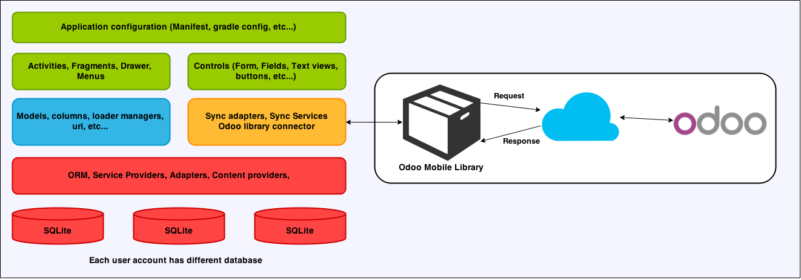
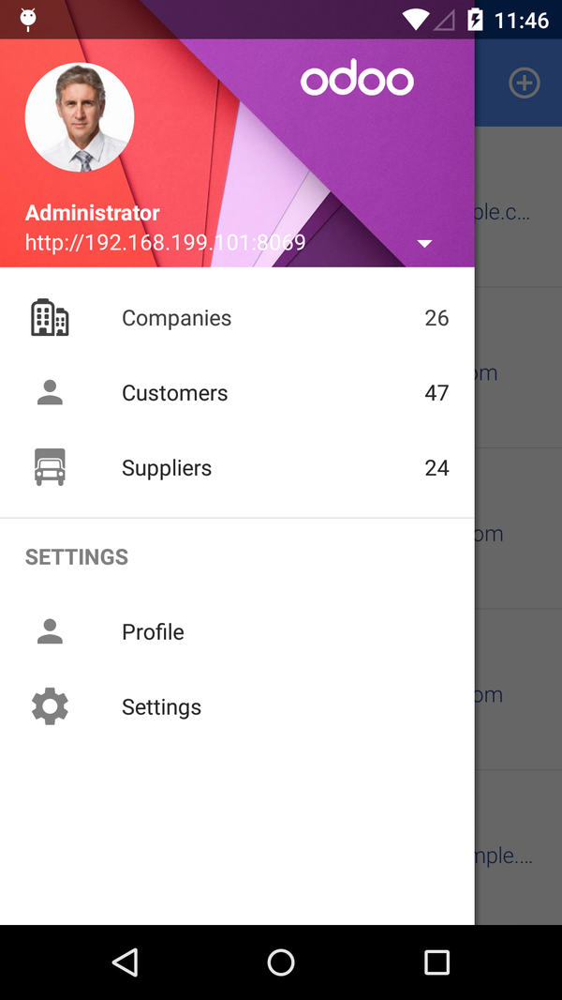
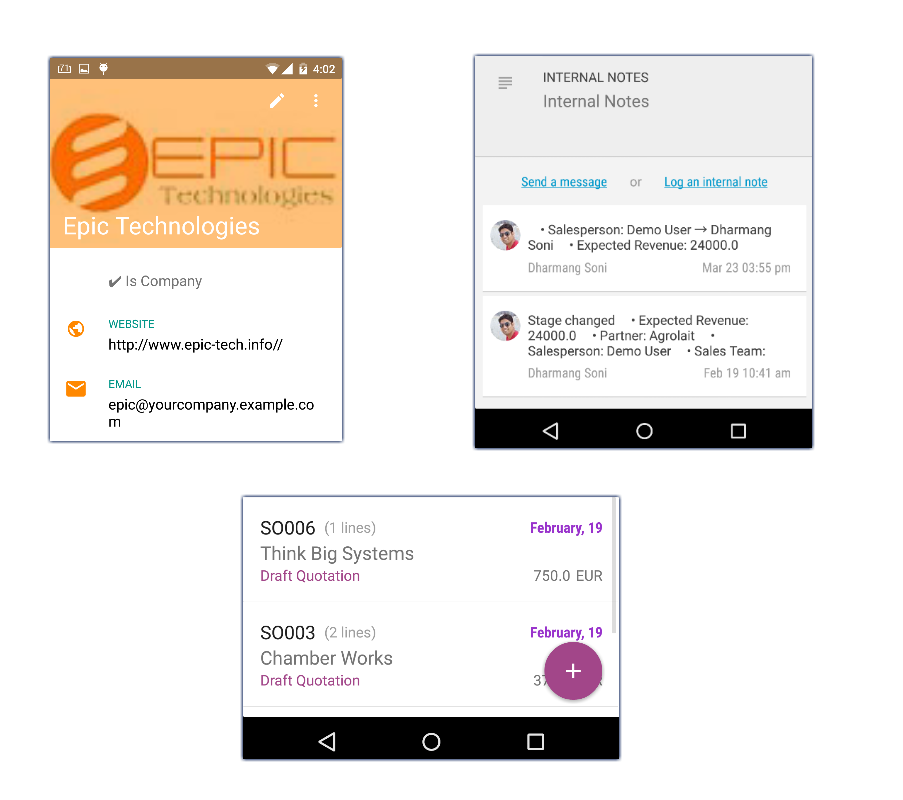
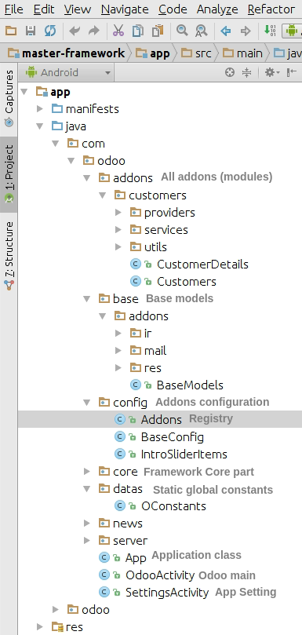
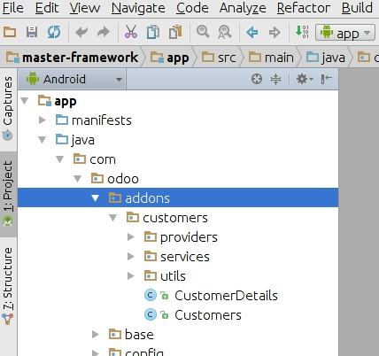
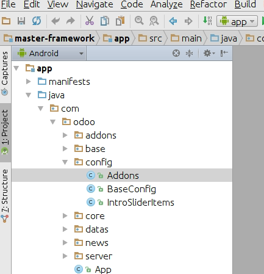
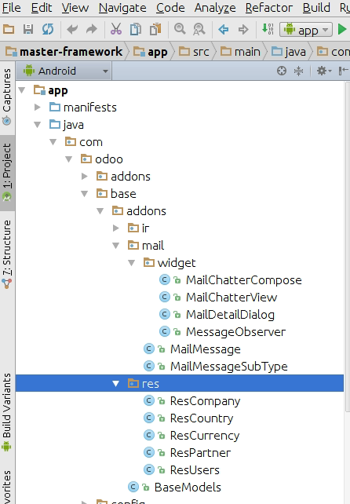
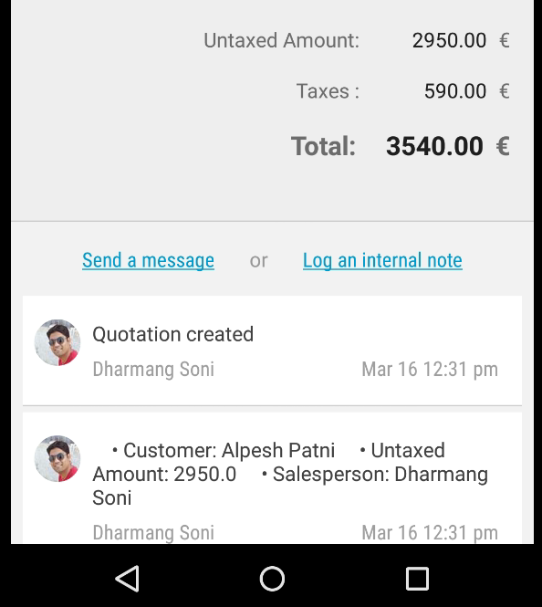

Understanding architecture
==========================

Framework Architecture
----------------------

.. index:: Framework Architecutre

Core architecture Odoo Mobile framework uses:

Green Layer
~~~~~~~~~~~

.. index:: Green Layer

Full user customizable part. 

**Application Configuration**

.. index:: Aplication Config

Android Manifest, Gradle configuration are at this layer. Generally used for changing package (application ID), application version, register activities, providers, services, receivers and more.

Ref (Android Manifest): http://developer.android.com/guide/topics/manifest/manifest-intro.html

Ref (Build Gradle) : https://developer.android.com/tools/building/configuring-gradle.html

**Activities, Fragments, Drawer menus**

An **Activity** is an application component that provides a screen with which users can interact in order to do something, Each activity is given a window in which to draw its user interface. The window typically fills the screen, but may be smaller than the screen and float on top of other windows. More at http://developer.android.com/guide/components/activities.html

A **Fragment** represents a behavior or a portion of user interface in an Activity. You can combine multiple fragments in a single activity to build a multi-pane UI and reuse a fragment in multiple activities. More at http://developer.android.com/guide/components/fragments.html

The **navigation drawer** is a panel that transitions in from the left edge of the screen and displays the app’s main navigation options. More at https://developer.android.com/training/implementing-navigation/nav-drawer.html

Framework provide easy management with the navigation drawer. You just need to provide menu items and its callback. Have a look for Odoo Mobile drawer. Also it is fully customizable. 

**Controls (Form, Fields, Actionbar menus, FAB Button, and more..)**

Odoo Mobile framework provides inbuild controls for faster build your layouts. 

- Form
- Fields
	- Boolean
	- Text 
	- Radio
	- Checkbox
	- ManyToOne
	- Spinner
	- DateTime
	- and more...
- FAB Button
- Pull to refresh (works with listview)

Blue Layer
~~~~~~~~~~

.. index:: Blue Layer

**Database models, data loaders, custom uris, custom content providers...**

Blue layer contais all your addons model (database table) archicture, business logic for your addon, code behind for your activities and fragments.

Also, there are loaders for your listviews, works with your model content provider. You can also create your custom content provider for custom queries and data loading.

Orange Layer
~~~~~~~~~~~~

.. index:: Orange Layer

Orange layer is repsonsible to get data from odoo server and provide it to framework synchronization base adapter. Framework will take care for offline data. It will compare your latest updated record and synchronize them as well update record in local and server. We have tried to give 100% offline support, but in some cases you need to override synchronization and have to put your own mechanism. Yes, of-course its customizable. :P

Red Layer
~~~~~~~~~

.. index:: Red Layer

Red layer contains all the core components used by the frameworks. ORM, Synchronization base adapters, Base service providers, base content model providers and some utilitity classes. Red layer also responsible to manage application accounts, synchronization settings. 

Red layer and Orange layer are dependend part. 

.. danger::
	Change in this fiels causes system flow break. Kindly take copy before changes in red layer part.

Framework will create separate database for each of different account. By creating separate database it is possible to create different database version as per odoo versions.

Directory structure
-------------------

.. index:: Directory Structure

Directory structure is same as standard android studio android application structure. Framework has organized some of the packages for faster development and easy understandability of addons (modules).

Addons
~~~~~~

All modules (addons) are under ``com.odoo.addons`` package

All the modules are created under **addons** package along with module package name as shown in figure.

@See :doc:`Working with addons </getting-started/working-with-odoo-mobile/components/addons>`

Addons Registry
~~~~~~~~~~~~~~~

.. index:: Addon Registry

Each addons has its parent view. Such as List of customers, which loaded when user click on Drawer menu item. 
We have to register each of the parent class for addon in ``Addons.java`` under ``com.odoo.config`` package.

Create your feature object with OAddon class named with your feature and provide your feature class (which extends BaseFragment) as below:

.. code-block:: java

	public class Addons extends AddonsHelper {

	    /**
	     * Declare your required module here
	     * NOTE: For maintain sequence use object name in asc order.
	     * Ex.:
	     * OAddon partners = new OAddon(Partners.class).setDefault();
	     */
	    OAddon customers = new OAddon(Customers.class).setDefault();
	}

If you want to make your addons default to load when application starts. Just add chaining method **setDefault()**

You can create multiple object as member in this class. 

Tips:
For shorting your features just put alphabetical ordered name to your features.

E.g:

.. code-block:: java
	
	OAddon a_sales = new OAddon(Sale.class).setDefault();
	OAddon b_messaging = new OAddon(Messaging.class);
	OAddon c_customers = new OAddon(Customer.class);

.. note::
	System automatically create database as you applied in your ``BaseFragment.java`` but if some of the model are not creating automaticallly then you can add thoes models in ``BaseModels.java``

.. _ref-base-models:

Base models
~~~~~~~~~~~

.. index:: Base Models Intro

Odoo mobile framework comes with some of base models, such as *res.partners, res.users, mail.message, ir.attachments* and more..

Contains all the base models (database models) used by framework itself. 

You can modify it (add or update columns as you required). Default it contains, ir.attachment, ir.model, mail.message (for chatter), res_* related models such as res_partner, res_users and so on. 

You can also add your base model; after adding your model you need to register it in ``BaseModels.java`` file.

.. code-block:: java

	public class BaseModels {
	    public static final String TAG = BaseModels.class.getSimpleName();

	    public static List<OModel> baseModels(Context context, OUser user) {
	        List<OModel> models = new ArrayList<>();
	        models.add(new OdooNews(context, user));
	        models.add(new IrModel(context, user));
	        models.add(new ResPartner(context, user));
	        models.add(new ResUsers(context, user));
	        models.add(new ResCompany(context, user));
	        models.add(new IrAttachment(context, user));
	        models.add(new MailMessage(context, user));
	        return models;
	    }
	}

Mail Chatter (Widget)
*********************

.. index:: Mail Chatter (Widget)

Widget under ``com.odoo.base.addons.mail.widget``

Mail chatter widget : provide chatter view for each of the record after form view. **Note: works with OForm control only**. 

You can integrate mail chatter widget with OForm control by providing **setHasChatter(true);** in models constructor.

.. code-block:: java

	...
	public ResPartner(Context context, OUser user) {
		super(context, "res.partner", user);
		setHasMailChatter(true);
	}
	...

@See :doc:`Chatter View </getting-started/working-with-odoo-mobile/components/chatter-view>`

