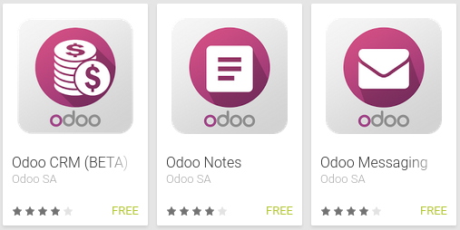

.. index:: First Step

First step to Odoo Mobile
-------------------------

Odoo is the fastest evolving business software in the world. Odoo has a complete suite of business applications covering all business needs, from Website/Ecommerce down to manufacturing, inventory and accounting, all seamlessly integrated. It is the first time ever a software editor managed to reach such a functional coverage.

World is contracting with the growth of mobile phone technology. As the number of users is increasing day by day, facilities are also increasing. Now a days mobiles are not used just for making calls but they have innumerable uses and can be used as a Camera , Music player, Tablet PC, T.V. , Web browser etc. And with the new technologies, new software and operating systems are required.

One of the most widely used mobile OS these days is **ANDROID**. Android is a software bunch comprising not only operating system but also middleware and key applications.

**Odoo Mobile framework** is an open source mobile application development framework with **Odoo integration**. With the help of this mobile framework we can rapidly develop almost all Odoo supported application as faster as we can develop in Odoo Framework.

This framework contains its own ORM to handle mobile’s local database. So you do not have to worry about data comming from Odoo Server. It has pre-developed services and providers to make your application data synchronized with Odoo. 

Here is some of the application build with Odoo Mobile Framework (Also available on PlayStore):

